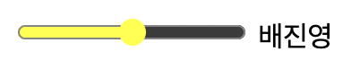

## accent-color

MDN에 따르면 이는 'CSS 속성은 일부 요소에서 생성된 사용자 인터페이스 컨트롤의 강조 색상을 설정 합니다.'라고 표기되어 있다.

쉽게 말해 강조 색상을 설정 한다는 건 radiobutton이나 checkbox 같은 것을 체크하면 기본적으로 브라우저에서 파란색으로 체크가 되는 것을 확인할 수 있다 그 외에도 progress나 input:range와 같이 모두 파란색이 적용되는 것을 확인 할 수 있다.

이 색깔을 바꾸는 역할을 accent-color가 하는 것이다

```html
<label for="">
  <input type="range" value="배진영" />
  배진영
</label>
```

```css
input {
  accent-color: #ffff00;
}
```



## align-content

justify-content 기본 축 내에서 개별 항목을 정렬 하는 방법과 유사하게 교차 축에 추가 공간이 있을 때 플렉스 컨테이너의 라인을 정렬하는 데 도움이 됩니다.

이 속성은 flexbox에 한 줄만 있는 경우에는 효과가 없습니다.

이 align-content 속성은 6가지 다른 값을 허용합니다.

- flex-start: 컨테이너의 시작 부분에 채워진 줄
- flex-end: 컨테이너 끝까지 채워진 줄
- center: 용기 중앙에 채워진 선
- space-between: 선이 고르게 분포됨; 첫 번째 줄은 컨테이너의 시작 부분에 있고 마지막 줄은 끝에 있습니다.
- space-around: 선 사이에 동일한 간격으로 균등하게 분포된 선
- stretch ( 기본값 ): 나머지 공간을 차지하도록 줄이 늘어납니다.

## align-self

align-self속성은 Flexible Box Layout 모듈 의 하위 속성입니다 .

align-items특정 플렉스 항목 의 값을 재정의할 수 있습니다.

이 align-self속성은 다음과 동일한 5개의 값을 허용합니다 align-items.

- flex-start: 항목의 교차 시작 여백 가장자리가 교차 시작 라인에 배치됩니다.
- flex-end: 아이템의 크로스 엔드 여백 가장자리가 크로스 엔드 라인에 배치됩니다.
- center: 항목이 교차 축의 중앙에 있습니다.
- baseline: 기준선이 정렬된 것처럼 항목이 정렬됩니다.
- stretch (기본값): 컨테이너를 채우기 위해 늘이기(여전히 최소 너비/최대 너비를 준수함)

## all

CSS 의 속성 은 텍스트 방향을 제어 하는 및 속성을 all제외하고 선택한 요소의 모든 속성을 재설정합니다

- initial: 선택한 요소의 모든 속성을 CSS 사양에 정의된 초기 값으로 재설정합니다.
- inherit: 선택한 요소는 일반적으로 상속할 수 없는 스타일을 포함하여 상위 요소의 모든 스타일을 상속합니다.
- unset: 선택한 요소는 상위 요소에서 전달된 상속 가능한 값을 상속합니다. 상속 가능한 값이 없으면 CSS 사양의 초기 값이 각 속성에 사용됩니다.

일부 속성에는 사양에 명시적으로 정의된 초기 값이 없고 대신 사용자 에이전트가 초기 값을 설정할 수 color있으며 font-family두 가지 예가 있습니다. all: initial;또는 가 적용 되면 all: unset;사용자 에이전트 기본값 initial이 이러한 속성의 값으로 사용됩니다.

all단일 선언 으로 모든 CSS 속성 의 값을 한 번에 제어할 수 있기 때문에 "약식" 속성으로 간주됩니다 . 그러나 대부분의 속기 속성과 달리 실용적인 "장기" 버전이 없으며 하위 속성도 없습니다.

```css
.tag {
  all: initial;
}
```

## appearance

이 appearance속성은 사용자의 운영 체제 테마를 기반으로 하는 플랫폼 네이티브 스타일을 사용하여 요소를 표시하는 데 사용됩니다.

속성은 다음 appearance두 가지 이유 중 하나로 사용됩니다.

1. 기본적으로 없는 요소에 플랫폼별 스타일 지정을 적용하려면
2. 기본적으로 포함하는 요소에 대한 플랫폼별 스타일 지정을 제거하려면

```css
/* CSS Basic User Interface Module Level 4 values */
appearance: none;
appearance: auto;
appearance: menulist-button;
appearance: textfield;

/* "Compat-auto" values, which have the same effect as 'auto' */
appearance: button;
appearance: searchfield;
appearance: textarea;
appearance: push-button;
appearance: slider-horizontal;
appearance: checkbox;
appearance: radio;
appearance: square-button;
appearance: menulist;
appearance: listbox;
appearance: meter;
appearance: progress-bar;

/* Partial list of available values in Gecko */
-moz-appearance: scrollbarbutton-up;
-moz-appearance: button-bevel;

/* Partial list of available values in WebKit/Blink (as well as Gecko and Edge) */
-webkit-appearance: media-mute-button;
-webkit-appearance: caret;

/* Global values */
appearance: inherit;
appearance: initial;
appearance: revert;
appearance: unset;
```

## aspect-ratio

CSS 속성 을 사용하면 상자의 및 상자가 비율로 자동 계산 aspect-ratio되는 비례 치수를 유지하는 상자를 만들 수 있습니다 . 약간 수학적인 표현이지만 이 속성에서 한 값을 다른 값으로 나눌 수 있으며 계산된 값은 상자가 해당 비율로 유지되도록 합니다. height width

즉, 이 속성은 요소의 크기를 일관되게 조정하는 데 도움이 되므로 요소의 비율이 커지거나 줄어들 때 동일하게 유지됩니다.

```css
.element {
  aspect-ratio: 2 / 1; /* ↔️ is double the ↕️ */
}

.element {
  aspect-ratio: 1 / 1; /* ⏹ a perfect square */
}
```

### aspect-ratio가 적용되지 않는 경우

1. width요소에서 및 둘 다 height선언된 경우
2. 콘텐츠가 비율을 벗어날 때
3. min-*및 max-*속성 에 "손실"될 때
