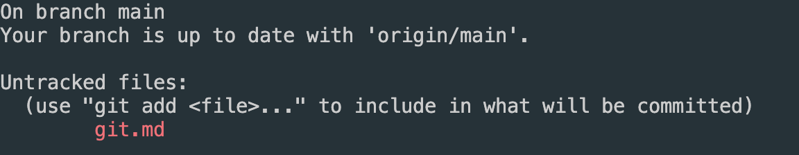
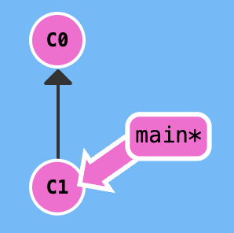
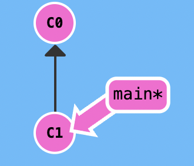
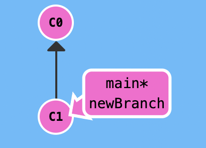
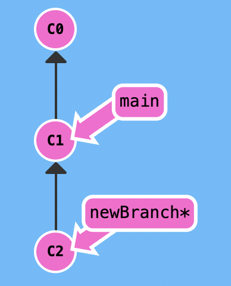
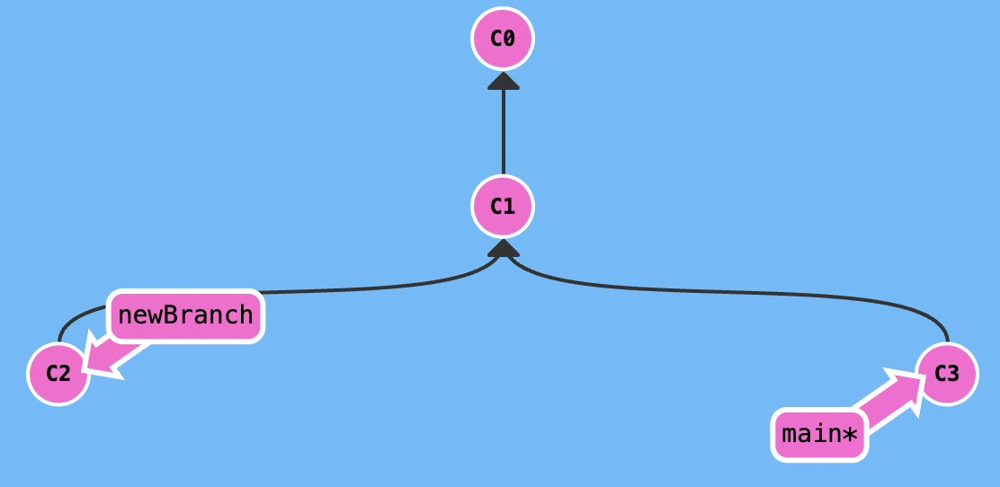
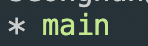
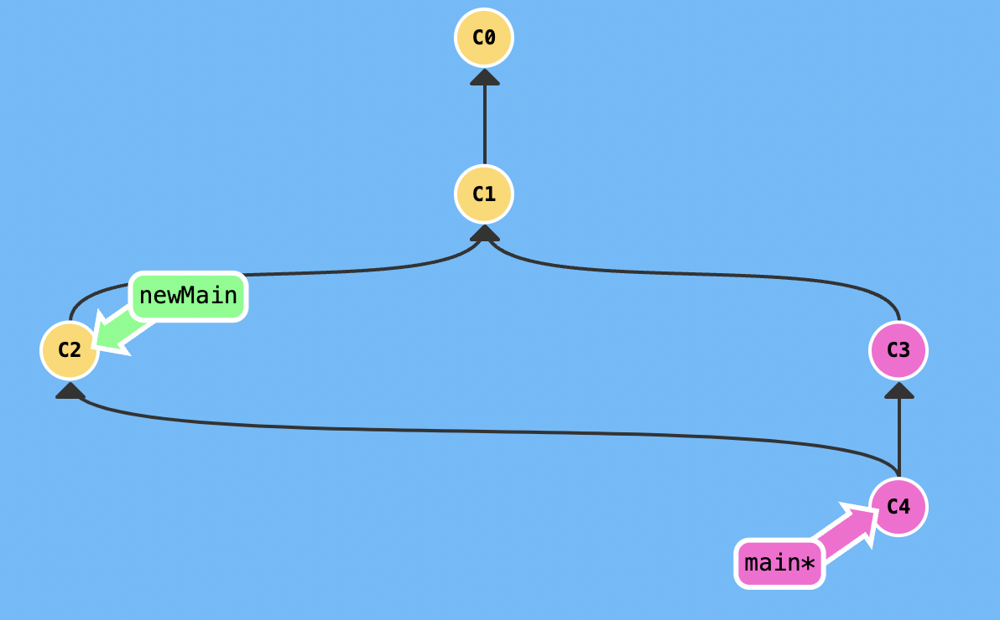

# git

이 글은 https://learngitbranching.js.org/?locale=ko 사이트를 참고하여 쓰여졌습니다.

## Local

### git status

git status 명령어는 작업 디렉토리(working directory)와 스테이징 영역(staging area)의 상태를 확인하기 위해서 사용

이를 알기위해 git status를 한번 사용하여 결과를 보자.



현재 git status를 확인해 보면 Untracked file이라는 영역이 보일것입니다. 고친 파일이 없어 현재는 저것 밖에 뜨지 않지만 원래 3가지 영역이 있다.

- Changes to be committed: 이 영역은 스테이징 영역에 넘어가 있는 변경 내용을 보여줍니다.
- Changes not staged for commit: 이 영역은 아직 워킹 디렉토리에 있는 변경 내용을 보여줍니다.
- Untracked files: 이 영역도 아직 워킹 디렉토리에 있는 아직 한 번도 해당 Git 저장소가 관리한 적이 없는 새로운 파일을 보여줍니다.

스테이징 영역, 워킹 디렉토리라는 단어를 간략히 짚고 넘어가겠다.

워킹 디렉토리란 내가 수정하고 있는 파일이 있는 폴더를 의미합니다. 다시 말해 자신이 작업하는 영역이 워킹 디렉토리.

스테이징 영역이란 커밋을 하기위해 git add 명령어를 통해 추가된 파일들이 있는 영역

### add

git add 명령어는 커밋 하기 까지의 변경부분을 기록하는 것이다.
add 명령어는 저장하는 것이 아닌 그저 어느 정도 바꿨는지 기록하는 것으로 아무리 많은 add 명령어를 실행해도 Git 저장소에 어떤 영향도 주지 않는다.

먼저 첫번 째는 작업 한 것을 일부한 스테이징 영역에 추가하고 싶을 때이다.

    git add <파일>

다음과 같이 일부만 추가 하고 싶을 때는 git add 뒤에 직접적으로 추가할 것을 입력해 주면 된다.

    git add .

이렇게 add 뒤에 .을 적게되면 모든 수정사항을 스테이징 영역에 추가한다는 것이다.

    git add -A

그리고 git add .과 비슷한 -A가 있습니다. 이 두가지의 차이점은 상위 디렉토리의 수정사항을 포함하냐 안하냐 이다.
git add . 은 현재 디렉토리 하위 폴더로만 스테이징 영역에 추가하지만 git add -A는 루트 디렉토리부터 모두 추가하게 되는 것이다.

마지막으로 -p 속성이 있다

    git add -p

이 옵션을 사용하면, 각 변경 사항을 터미널에서 직접 눈으로 하나씩 확인하면서 스테이징 영역으로 넘기거나 또는 제외할 수가 있다.

### commit

간단히 커밋이란 git add 명령어를 통한 기록을 저장하는 행위라고 생각한다.

현재 가르키고 있는 커밋, HEAD를 c0, 즉 이곳을 main 브랜치라고 가정하겠습니다. 만일 이 곳에서 코드가 다음과 같이 구성되어 있다고 생각해 보자.

```js
const a = "a";
```

그런데 워킹 디렉토리에서 코드를 수정

```js
const a = "a";
console.log(a);
```

그리고 이를 git add .으로 스테이징 영역으로 넘겼다고 해봅시다. 이 때 저희는 git commit 명령어를 사용할 수 있는 것이다.

git commit 명령어는 git 저장소에 기록하는 행위로 git add와는 다르게 저장소에 영향을 준다.

    git commit

이렇게 된다면 HEAD, c0에서 c1이라는 새로운 커밋이 기록 되는 것이다.



당연한 소리지만 이 때 c0와 c1, 두 커밋에 내용은 다르다. c0는 원래 적혀있던 내용, c1는 바꾸고 난 후 기록한 내용

그러면 이제 commit 명령어의 옵션에 대해 알아보자

    git commit -m "메세지"
    git commit -a
    git commit -am "메세지"

옵션이 매우 많기에 대표적인 것만 적어놓았다.

-m 옵션부터 알아보자면 massage를 의미하는 것으로 "메세지"와 함께 기록하는 것입니다. 내가 위에 코드처럼 콘솔로그를 추가 하였으므로
git commit -m "add: console.log"라고 한다면 이 메세지와 함께 기록되는 것입니다. 이 커밋이 어떤 커밋인지 알아보기 쉽도록 말이다.

-a 이는 git add와 git commit을 합친 것.

-am 이 옵션은 -a,-m을 한번에 작업하는 옵션이다.

그렇다면 메세지를 적을 때 다른 사람 또한 이 커밋이 왜 나왔는지 알아보기 쉽게 메세지를 작성해 주어야 한다. 그렇기에 지금부터 커밋 메세지 작성 규칙에 대해 알아볼 것이다.

### git commit message rule

먼저 메세지를 적을 때 규칙으로는 다음과 같은 규칙이 있다.

- 제목과 본문을 빈 행으로 구분한다
- 제목을 50글자 내로 제한
- 제목 첫 글자는 대문자로 작성
- 제목 끝에 마침표 넣지 않기
- 제목은 명령문으로 사용하며 과거형을 사용하지 않는다
- 본문의 각 행은 72글자 내로 제한
- 어떻게 보다는 무엇과 왜를 설명한다

뿐만이나라 다음과 같은 type도 적어줘야 한다.

- FEAT : 새로운 기능의 추가
- FIX: 버그 수정
- DOCS: 문서 수정
- STYLE: 스타일 관련 기능(코드 포맷팅, 세미콜론 누락, 코드 자체의 변경이 없는 경우)
- REFACTOR: 코드 리펙토링
- TEST: 테스트 코트, 리펙토링 테스트 코드 추가
- CHORE: 빌드 업무 수정, 패키지 매니저 수정(ex .gitignore 수정 같은 경우)

### branch

브랜치가 필요한 이유는 여러가지가 있는데 몇가지만 짚어보자면 먼저 프로젝트를 만드는데 어떤 특정 기능을 만들 떄 한번에 만들 자신이 없는 상황 개발하다 코드가 꼬일거 같은 느낌이 들때, 또 협업할 때 동시에 여러사람이 같은 파일을 수정하고 저장한다고 생각해보자. 과연 이렇게 되면 어떻게 될까... 이를 해결 하기위해 브랜치를 사용하는 것이다.

기본적으로 만들어지는 master or main 브랜치가 아닌 다른 브랜치를 생성하여 사용하는 것이다.

브랜치를 생성하는 방법은 다음과 같다.

    git branch [브랜치이름]

그러면 브랜치가 생성되는 것을 좀 더 자세히 알아 보겠다.

현재 우리는 c1, main 브랜치를 가르키고 있다.



여기서 우리가 브랜치를 생성하게되면 우리가 가르키고 있는 c1 자리에 새로운 브랜치가 생성되게 되는 것이다.



이제 새로운 브랜치를 통해서 커밋을 해보겠다.



다음 처럼 main 브랜치는 수정되지 않고 새로운 브랜치만 바뀌는 것을 확인 할 수 있다. 그러면 이때 main 브랜치를 수정하여 커밋한다면 어떻게 될까?



다음과 같은 그림처럼 커밋이 되는 것을 확인 할 수 있다.
이렇게 새로운 브랜치를 파게 된다면 main 브랜치와는 완전히 다르다는 것을 알 수 있다.

그리고 브랜치가 늘어나다보면 이 프로젝트에 어떤 브랜치가 있었는지 헷갈리게 된다. 그렇기에 브랜치 목록을 확인해보겠다.

    git branch --list



여기서 현재 우리가 선택? 사용중인? 브랜치는 \*표시가 뒤에 붙게 된다.

    git branch --list 'feature/*'

이렇게 되면 기능 개발 브랜치 확인인데 이는 브랜치 생성 규칙에 이유가 있으므로 뒤에서 브랜치 생성 규칙을 알아보겠다.

브랜치를 필요없어졌을 때 브랜치를 삭제하는 방법은 다음과 같다.

    git branch -d [BRANCH_NAME]
    git branch --delete [BRANCH_NAME]

하지만 이 것으로 모든 브랜치를 삭제할 수 있는 것은 아니다. 바로 머지 되지 않은 브랜치가 그렇다
merge 합치는 것인데 이 또한 뒤에서 설명할 것이다. 그냥 단지 머지 되지 않은 브랜치를 삭제할 때는 다음과 같이 한다고만 알면 된다.

    git branch -D [브랜치이름]
    git branch --delete --force [브랜치이름]

### merge

여러 브랜치를 사용하여 개발하면 각 브랜치마다 내용이 달라진다. 이때 각 브랜치마다 개발한 코드를 합칠 때 사용하는 것이 머지이다.


다음과 같이 main 브랜치가 있다. 거기서 newMain이라는 브랜치를 파서 각각 둘다 커밋을 한 후 merge를 통해 합친 것이 밑에 그림이다



아마 merge가 어떤것인지 느낌이 들었을 것이다. 이제 쓰는 방법에 대해 알아보자.

1. git merge [브랜치이름]

현 브랜치와 병합할 브랜치가 Fast-Forward 관계 O: 병합할 브랜치(커밋)을 따라감. without Merge 커밋  
현 브랜치와 병합할 브랜치가 Fast-Forward 관계 X : 병합할 브랜치와 병합됨. with Merge 커밋

2. git merge --no-ff [병합할 브랜치 명]

현재 브랜치와 병합 대상의 관계가 Fast-Forward이던 아니던 무조건 Merge 커밋과 같이 병합되는 옵션

3. git merge --ff-only [병합할 브랜치 명]

현재 브랜치와 병합 대상의 관계가 Fast-Forward인 경우에만 병합 진행. Merge 커밋 생성되지 않음

4. git merge --squash [병합할 브랜치 명]

현재 브랜치에 병합 대상과의 차이나는 commit을 하나로 합쳐서 커밋함

여기서 나오는 fast forward 관계를 모른다면 https://otzslayer.github.io/git/2021/12/05/git-merge-fast-forward.html 이 글을 읽으면 될것이다

## rebase

rebase는 merge와 마찬가지로 병합하는 용도이다.
용도는 같지만 차이점이 분명히 존재한다.

두 개를 간단히 말하자면  
Merge는 쉽고 안전하지만 커밋히스토리가 지저분할 수 있다 반면 Rebase는 잘 모르고 사용할 경우 위험할 수 있어 까다롭지만 커밋히스토리를 깔끔하게 관리할 수 있다.

merge로만 합쳤을 때 지저분해지는 예시를 살펴보겠다.


