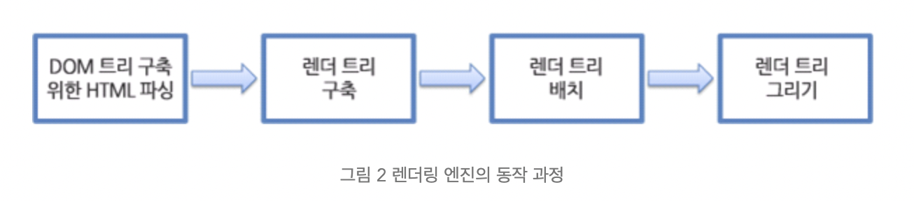

# 브라우저의 작동

## 브라우저란

브라우저란 웹 페이지, 이미지, 비디오 등의 콘텐츠를 수신, 전송 및 표현하는 소프트웨어다. 우리가 인터넷에 접속하기 위해 사용하는 크롬, 사파리, 엣지, 파이어폭스 등이 바로 브라우저다. 각 브라우저는 서로 다른 데이터 해석 방식을 갖고 있을 수 있는데, 때문에 특정 웹사이트의 외관 또는 기능이 브라우저마다 다르게 표현될 수 있다. 브라우저는 서버로부터 데이터를 전송받고, 렌더링 엔진을 사용해 이를 텍스트 및 이미지 등으로 변환한다. 해당 데이터는 HTML 코드로 작성되어 있으며, 브라우저는 이러한 HTML 코드를 읽고 최종 화면을 사용자에게 표시하는 역할을 한다.

## 브라우저에 구조

1. 사용자 인터페이스 - 주소 표시줄, 이전/다음 버튼, 북마크 메뉴 등. 요청한 페이지를 보여주는 창을 제외한 나머지 모든 부분이다.
2. 브라우저 엔진 - 사용자 인터페이스와 렌더링 엔진 사이의 동작을 제어.
3. 렌더링 엔진 - 요청한 콘텐츠를 표시. 예를 들어 HTML을 요청하면 HTML과 CSS를 파싱하여 화면에 표시함.
4. 통신 - HTTP 요청과 같은 네트워크 호출에 사용됨. 이것은 플랫폼 독립적인 인터페이스이고 각 플랫폼 하부에서 실행됨.
5. UI 백엔드 - 콤보 박스와 창 같은 기본적인 장치를 그림. 플랫폼에서 명시하지 않은 일반적인 인터페이스로서, OS 사용자 인터페이스 체계를 사용.
6. 자바스크립트 해석기 - 자바스크립트 코드를 해석하고 실행.
7. 자료 저장소 - 이 부분은 자료를 저장하는 계층이다. 쿠키를 저장하는 것과 같이 모든 종류의 자원을 하드 디스크에 저장할 필요가 있다. HTML5 명세에는 브라우저가 지원하는 '웹 데이터 베이스'가 정의되어 있다.

## 렌더링 엔진

렌더링 엔진의 역할은 요청 받은 내용을 브라우저 화면에 표시하는 일이다.
파이어폭스와 크롬, 사파리는 두 종류의 렌더링 엔진으로 제작되었다. 파이어폭스는 모질라에서 직접 만든 게코(Gecko) 엔진을 사용하고 사파리와 크롬은 웹킷(Webkit) 엔진을 사용한다.

### 동작 과정

렌더링 엔진은 통신으로부터 요청한 문서의 내용을 얻는 것으로 시작하는데 문서의 내용은 보통 8KB 단위로 전송된다.

렌더링 엔진은 HTML 문서를 파싱하고 "콘텐츠 트리" 내부에서 태그를 DOM 노드로 변환한다. 그 다음 외부 CSS 파일과 함께 포함된 스타일 요소도 파싱한다. 스타일 정보와 HTML 표시 규칙은 "렌더 트리"라고 부르는 또 다른 트리를 생성한다.

렌더 트리는 색상 또는 면적과 같은 시각적 속성이 있는 사각형을 포함하고 있는데 정해진 순서대로 화면에 표시된다.

렌더 트리 생성이 끝나면 배치가 시작되는데 이것은 각 노드가 화면의 정확한 위치에 표시되는 것을 의미한다. 다음은 UI 백엔드에서 렌더 트리의 각 노드를 가로지르며 형상을 만들어 내는 그리기 과정이다.

일련의 과정들이 점진적으로 진행된다는 것을 아는 것이 중요하다. 렌더링 엔진은 좀 더 나은 사용자 경험을 위해 가능하면 빠르게 내용을 표시하는데 모든 HTML을 파싱할 때까지 기다리지 않고 배치와 그리기 과정을 시작한다. 네트워크로부터 나머지 내용이 전송되기를 기다리는 동시에 받은 내용의 일부를 먼저 화면에 표시하는 것이다.

## 출처

https://oneroomtable.tistory.com/entry/%EB%B8%8C%EB%9D%BC%EC%9A%B0%EC%A0%80%EC%9D%98-%EA%B0%9C%EB%85%90%EA%B3%BC-%EC%97%AD%ED%95%A0

https://d2.naver.com/helloworld/59361
