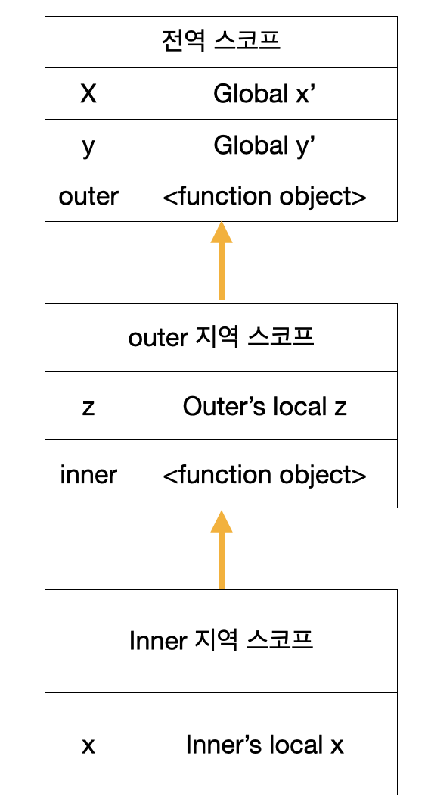

# scope

스코프의 예시를 간단히 알아보고 시작하겠다.

```js
function add(x, y) {
  console.log(x, y); // 2 5
  return x + y;
}

add(2, 5);

console.log(x, y); // ReferenceError: x is not defined
```

이 코드는 당연하게 보일것이다.
x와 y는 함수 add의 매개변수이므로 유효범위 즉 스코프는 add 함수 내부이다.
이처럼 스코프란 유효범위를 뜻한다

```js
var var1 = 1;

if (true) {
  var var2 = 2;
  if (true) {
    var var3 = 3;
  }
}

function foo() {
  var var4 = 4;

  function bar() {
    var var5 = 5;
  }
}

console.log(var1); // 1
console.log(var2); // 2
console.log(var3); // 3
console.log(var4); // ReferenceError: var4 is not defined
console.log(var5); // ReferenceError: var5 is not defined
```

이처럼 다시 말해 모든 식별자는 자신이 선언된 위치에 의해 다른 코드가 식별자 자신을 참조할 수 있는 유효 범위가 결정된다. 이를 스코프라 한다. 즉 스코프는 식별자가 유효한 범위를 말한다.

```js
var x = "global";

function foo() {
  var x = "local";
  console.log(x); // 1
}

foo();

console.log(x); // 2
```

다음 코드는 바깥 영역과 foo 함수 내부에 같은 이름에 갖는 x 변수를 선언했을 때 1과 2에서 x 변수를 참조한다.  
이때 자바스크립트 엔진은 이름이 같은 두 개의 변수 중에서 어떤 변수를 참조해야 할 것인지를 결정해야한다. 이를 식별자 결정(identifier resolution)이라 한다. 자바스크립트 엔진은 스코프를 통해 어떤 변수를 참조해야 할 것인지 결정한다. 따라서 스코프란 자바스크립트 엔진이 식별자를 검색할 때 사용하는 규칙이라고도 할 수 있다.

자바스크립트 엔진은 코드를 실행할 때 코드의 문맥(context)을 고려한다. 코드가 어디서 실행되며 주변에 어떤 코드가 있는지에 따라 위 예제의 1과 2처럼 동일한 코드도 다른 결과를 만들어 낸다.

위 예제에서 코드의 가장 바깥 영역에 선언된 x 변수는 어디서든 참조할 수 있다. 하지만 foo 함수 내부에서 선언된 x 변수는 foo 함수 내부에서만 참조할 수 있고 foo 함수 외부에서는 참조할 수 없다. 이때 두 개의 x 변수는 식별자 이름이 동일하지만 자신이 유효한 범위, 즉 스코프가 다른 별개의 변수다.

만약 스코프라는 개념이 없다면 같은 이름을 갖는 변수는 충돌을 일으키므로 프로그램 전체에서 하나밖에 사용할 수 없다.

var 키워드로 변수를 선언하면 중복 선언이 허용된다. 이는 의도치 않게 변수값이 재할당되어 변경되는 부작용을 발생시킨다.

```js
function foo() {
  var x = 1;
  var x = 2;
  console.log(x); // 2
}

function bar() {
  let x = 1;
  let x = 2; // SyntaxError: Identifier 'x' has already been declared
}
```

## 스코프의 종류

코드는 전역과 지역으로 구분할 수 있다.

| 구분 |         설명          |   스코프    |   변수    |
| :--: | :-------------------: | :---------: | :-------: |
| 전역 | 코드의 가장 바깥 영역 | 전역 스코프 | 전역 변수 |
| 지역 |    함수 몸체 내부     | 지역 스코프 | 지역 변수 |

```js
var x = "global x";
var y = "global y";

function outer() {
  var z = "outer's local z";

  console.log(x); // global x
  console.log(y); // global y
  console.log(z); // outer's local z

  function inner() {
    var x = "inner's local x";

    console.log(x); // inner's local x
    console.log(y); // global y
    console.log(z); // outer's local z
  }

  inner();
}

outer();

console.log(x); // global x;
console.log(z); // ReferenceError: z is not defined
```

위처럼 함수는 전역에서 정의할 수도 있고 함수 몸체 내부에서 정의할 수도 있다. 함수 몸체 내부에서 함수가 정의된 것을 '함수의 중첩'이라 한다. 그리고 함수 몸체 내부에서 정의한 함수를 '중첩 함수', 중첩 함수를 포함하는 함수를 '외부 함수'라고 한다.

함수는 중첩될 수 있으므로 함수의 지역 스코프도 중첩될 수 있다.이는 스코프가 함수의 중첩에 의해 계층적 구조를 갖는다는 것을 의미한다. 다시 말해, 중첩 함수의 지역 스코프는 중첩 함수를 포함하는 외부 함수의 지역 스코프와 계층적 구조를 갖는다. 이때 외부 함수의 지역 스코프를 중첩 함수의 상위 스코프라 한다.

위 예제에 계층구조를 그림으로 나타내면 다음과 같다.



이처럼 모든 스코프는 하나의 계층적 구조로 연결되며, 모든 지역 스코프의 최상위 소크프는 전역 스코프다. 이렇게 스코프가 계층적으로 연결된 것을 <b>스코프 체인</b>이라 한다. 위 그림에서 스코프 체인은 최상위 스코프인 전역 스코프, 전역에서 선언된 outer 함수의 지역 스코프, outer 함수 내부에서 선언된 inner 함수의 지역 스코프로 이뤄진다.

변수를 참조할 때 자바스크립트 엔진은 스코프 체인을 통해 변수를 참조하는 코드의 스코프에서 시작하여 상위 스코프 방향으로 이동하며 선언된 변수를 검색한다. 이를 통해 상위 스코프에서 선언한 변수를 하위 스코프에서도 참조할 수 있다.

스코프 체인은 물리적인 실체로 존재한다. 자바스크립트 엔진은 코드를 실행하기에 앞서 위 그림과 유사한 자료구조인 렉시컬 환경을 실제로 생성한다. 변수 선언이 실행되면 변수 식별자가 이 자료구조에 키로 등록되고, 변수 할당이 일어나면 이 자료구조의 변수 식별자에 해당하는 값을 변경한다. 변경한다. 변수의 검색도 이 자료구조 상에서 이뤄진다.

## 함수 레벨 스코프

지역은 함수 몸체 내부를 말하고 지역은 지역 스코프를 만든다고 했다. 이는 블록이 아닌 함수에 의해서만 지역 스코프가 생성된다는 것이다.

c나 자바 등을 비롯한 대부분의 프로그래밍 언어는 함수 몸체만이 아니라 모든 코드 블록(if, for, while, try/catch 등)이 지역 스코프를 만든다. 이러한 특성을 블록 레벨 스코프라 한다. 하지만 var 키워드로 선언된 변수는 오로지 함수의 코드 블록만을 지역 스코프로 인정한다. 이러한 특성을 함수 레벨 스코프라 한다.

```js
var x = 1;

if (true) {
  var x = 10;
}

console.log(x); // 10
```

전역 변수 x가 선언되었고, if 문의 코드 블록 내에도 x 변수가 선언되었다. 이때 if 문의 코드 블록 내에서 선언된 x 변수는 전역 변수다. var 키워드로 선언하였기 때문에, 따라서 전역변수 x의 값이 10으로 재할당된다.
